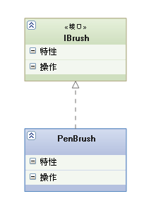
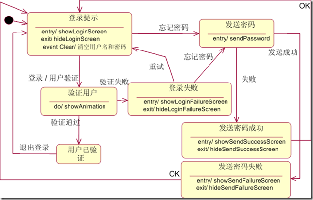

地理信息系统工程

## GIS设计思想、内容及标准

### GIS设计思想-工程学思想

目标

> &emsp;GIS设计目标就是通过改进系统设计方法、严格执行开发的阶段划分、进行各阶段质量把关以及做好项目建设的组织管理工作，从而达到增强系统的实用性、降低系统开发和应用的成本、延长系统生命周期的目的。

GIS设计特点

- [x] GIS处理的空间数据
- [x] GIS设计以空间数据为驱动
- [x] GIS工程投资大、周期长、风险大、涉及部门繁多

GIS工程学理论基础

1-系统学思想

- [x] 系统可以定义为由相互作用、相互依赖的若干组成部分（要素）构成的具有一定功能的有机整体。
- [x] 系统不是不可分割的单一体，而是一个可以分成许多部分的整体
- [x] 每一个系统都有其独特的层次结构、功能与环境。

2-系统工程学
> &emsp;系统工程是以大型复杂系统为研究对象，按照一定的目标对其进行研究、设计、开发、管理和控制，以期达到总体效果最优的理论和方法

- [x] 研究对象是一个表现为普遍联系、相互影响、规模和层次都极其复杂的大系统
- [x] 系统工程学的知识结构复杂，是自然科学和社会科学交叉的边缘学科
- [x] 系统工程学是方法学，是泛化系统的研究方法
- [x] 系统工程学是目的性很强的应用学科

3-软件工程学
> &emsp;软件工程是一门研究用工程化方法构建和维护有效的、实用的和高质量的软件的学科。
>
> ​    它涉及到程序设计语言，数据库，软件开发工具，系统平台，标准，设计模式等方面。
### GIS设计内容

#### 软件设计

&emsp;GIS软件设计在GIS软件开发中具有十分重要的地位，是构建一个高效的GIS软件的关键。
&emsp;GIS软件设计一般采用合适的软件生存周期
模型，作用：

- [x] 以图表和逻辑表达式的形式来描述定义和生产两个阶段
- [x] 提供了一种有目的和有规划的方式来建立质量保证体系

典型的软件生命周期模型

##### 瀑布模型

特点：阶段间具有顺序性和依赖性

1. 必须等前一阶段的工作完成之后，才能开始后一阶段的工作
2. 前一阶段的输出文档就是后一阶段的输入文档

优点：规范化、严格化、可验证性

缺点：响应慢、过程僵化

##### 喷泉模型

##### 增量模型

每一个增量意味着一个新的软件版本
每个增量过程都是一个完整的瀑布模型

快速原型模型

##### 螺旋模型

引入风险分析是螺旋模型的主要特点，其余部分构成以“用户评估”为驱动的“增量模型”

##### 敏捷开发模型

&emsp;敏捷开发的Scrum方法论：Scrum的核心在于迭代。团队首先浏览开发需求，考虑可用技术，并对自身技术及能力做出评估，找出并选择最佳方案去完成任务。Scrum的所有实践就是围绕着一个迭代和增量的过程开展的。

​	敏捷开发相较于其他开发模型开发速度较快，其核心在于迭代，首先基于用户需求将项目划分为小项目，然后对小项目进行规划、设计，每日进行沟通，每隔一段时间（一个月左右）完成一个小项目并回顾，继续迭代下一小项目。所有实践就是围绕着一个迭代和增量的过程开展的。

#### 数据库设计

&emsp;数据模型数据库系统是存储、管理、处理和维护数据的软件系统，包括数据库、数据库管理员及相关软件

- 数据库的核心是数据模型
- 数据模型既提供了考虑面向数据处理应用的概念基础，也提供了使用数据库系统的技术和工具的形式基础
- 数据模型是一种形式化描述数据、数据之间联系以及有关语义约束的方法，包括:数据结构、操作的集合、完整性约束

数据模型的选择

- [x] 文件模型 
- [x] 网状模型 
- [x] 层次模型 
- [x] 关系模型 
- [x] 对象-关系模型

#### 软件选择和硬件选择

软件 

- [x] 功能
- [x] 性能
- [x] 标准
- [x] 可扩展性
- [x] 许可
- [x] 难易程度

硬件

- [x] 操作系统

- [x] CPU

- [x] 磁盘（存储设备）

- [x] 内存

- [x] 网络

  

###  GIS设计规范和标准

（一）GIS规范化和标准化的作用

- GIS规范化与标准化是体现GIS软件开发、系统建立与运行质量的重要要素

- 实现信息共享，推进GIS发展的最基本保障

- 避免简单重复的系统开发工作

- 方便了数据共享，节约了资源

（二）GIS规范化和标准化的内容

- GIS相关的名词术语标准
- 与GIS软件工程开发有关的各种标准化活动，软件工程、软件测评等标
准；
- 与GIS数据库建设有关的活动，各种操作规程的制定、数据采集、数据
分类与编码、数据字典、文本编写、数据库安全等方面的标准实践；
- 与GIS数据共享有关的标准化工作，对数据质量控制、数据重用、数据
交换、网络安全等方面技术标准。

GIS规范化和标准化建设方向

- 地理信息标准
- 数据标准
- 信息技术标准
- 应用标准
- GIS的设计标准和系统评价标准

## GIS工程设计方法

### 结构化生命周期法

特点

- [x] 要求在系统建立之前就必须严格地定义和描述用户的需求。
- [x] 严格地按阶段进行，只有前一阶段完成之后，才能开始下一阶段的工作。

阶段

- [x] 系统开发准备阶段
- [x] 调查研究及可行性研究阶段
- [x] 系统分析阶段
- [x] 系统设计阶段
- [x] 系统实施阶段
- [x] 维护和评价阶段

### 原型法

阶段

- [x] 确定用户的基本需求
- [x] 开发初始原型
- [x] 利用原型来提炼用户需求
- [x] 修正和改进原型

分类
> &emsp;丢弃型原型:当原型开发后，已获得了更为清晰的需求反馈信息，原型无需保留而丢弃，开发的原型仅以演示为目的，这往往用在软件的用户面的开发

>&emsp;进化型原型:对需求的定义较清楚的情形，原型建立之后要保留，作为
系统逐渐增加的基础。
###面向对象设计方法
概述
>&emsp;面向对象（object-oriented ）:按人们认识客观世界的系统思维方式，采用基于对象（实体）的概念建立模型，模拟客观世界分析、设计、实现软件的办法。

对象
>&emsp;概念:即指现实世界中各种各样的实体。它可以指
具体的事物也可以指抽象的事物。

>&emsp;特征:属性 方法（运动规律、事件）

类
>&emsp;概念:类是具有相似内部状态和运动规律的实体的集合（或统称、
抽象）。

>&emsp;特性:抽象 继承 封装 重载 多态

#### **关系**

##### 1.泛化（Generalization）

【泛化关系】：是一种继承关系，表示一般与特殊的关系，它指定了子类如何特化父类的所有特征和行为。例如：老虎是动物的一种，即有老虎的特性也有动物的共性。

【箭头指向】：带三角箭头的实线，箭头指向父类

##### 2.实现（Realization）

【实现关系】：是一种类与接口的关系，表示类是接口所有特征和行为的实现.

【箭头指向】：带三角箭头的虚线，箭头指向接口

##### 3.关联（Association)

【关联关系】：是一种拥有的关系，它使一个类知道另一个类的属性和方法；如：老师与学生，丈夫与妻子关联可以是双向的，也可以是单向的。双向的关联可以有两个箭头或者没有箭头，单向的关联有一个箭头。

【代码体现】：成员变量

【箭头及指向】：带普通箭头的实心线，指向被拥有者

上图中，老师与学生是双向关联，老师有多名学生，学生也可能有多名老师。但学生与某课程间的关系为单向关联，一名学生可能要上多门课程，课程是个抽象的东西他不拥有学生。

下图为自身关联：

##### 4.聚合（Aggregation）

【聚合关系】：是整体与部分的关系，且部分可以离开整体而单独存在。如车和轮胎是整体和部分的关系，轮胎离开车仍然可以存在。

聚合关系是关联关系的一种，是强的关联关系；关联和聚合在语法上无法区分，必须考察具体的逻辑关系。

【代码体现】：成员变量

【箭头及指向】：带空心菱形的实心线，菱形指向整体

##### 5.组合 (Composition)

【组合关系】：是整体与部分的关系，但部分不能离开整体而单独存在。如公司和部门是整体和部分的关系，没有公司就不存在部门。

组合关系是关联关系的一种，是比聚合关系还要强的关系，它要求普通的聚合关系中代表整体的对象负责代表部分的对象的生命周期。

【代码体现】：成员变量

【箭头及指向】：带实心菱形的实线，菱形指向整体

6.依赖(Dependency)

【依赖关系】：是一种使用的关系，即一个类的实现需要另一个类的协助，所以要尽量不使用双向的互相依赖.

【代码表现】：局部变量、方法的参数或者对静态方法的调用

【箭头及指向】：带箭头的虚线，指向被使用者

各种关系的强弱顺序：

泛化 = 实现 > 组合 > 聚合 > 关联 > 依赖

下面这张UML图，比较形象地展示了各种类图关系：

#### **UML**

> 面向对象（object-oriented ）:按人们认识客观世界的系统思维方式，采用基于对象（实体）的概念建立模型，模拟客观世界分析、设计、实现软件的办法。

​	对象:即指现实世界中各种各样的实体。它可以指具体的事物也可以指抽象的事物。

​	类:类是具有相似内部状态和运动规律的实体的集合（或统称、抽象）。

UML的优点：

​	UML 语言使系统建模过程标准化，统一化，规范化。

​	UML在整个软件开发过程中采用相同的概念和表示方法，在不同的开发阶段，不必转换概念和表示方法，避

免了传统软件开发方法的两个鸿沟。

​	UML采用图形化的表现形式。产生的模型易于理解，易于开发人员与用户之间的沟通，从而能够及时得到用户的反馈信息。

​	用UML进行系统建模所得到的建模制品不仅仅包括各种模型框图，还有大量丰富的文档，这些文档给系统后期的维护工作带来了便捷。
​	UML不是一门程序设计语言，但可以使用代码生成工具将UML模型转换为多种程序设计语言代码，或使用反向生成工具将程序源代码转换为UML模型。

##### 1.用例图(use-case diagram)

> 用例是对系统提供的功能(即系统的具体用法)的描述。用例图从用户的角度描述系统功能，并指出各个功能的操作者。用例图定义了系统的功能需求。

​    

##### 2.静态图(static diagram)

>&emsp;这类图描述系统的静态结构，属于这类图的有**类图(class diagram)**和**对象图(object diagram)**。

>&emsp;类图不仅定义系统中的类，表示类与类之间的关系(例如，关联、依赖、泛化和细化等关系)，也表示类的内部结构(类的属性和操作)。类图描述的是一种静态关系，在系统的整个生命期内都是有效的。

>&emsp;对象图是类图的实例，它使用几乎与类图完全相同的图示符号。两者之间的差别在于，对象图表示的是类的多个对象实例，而不是实际的类。由于对象有生命周期，因此对象图只能在系统的某个时间段内存在。一般说来，对象图没有类图重要，它主要用来帮助对类图的理解，也可用在协作图中，表示一组对象之间的动态协作关系。

##### 3.行为图(behavior diagram)

>##### &emsp;这类图描述系统的动态行为和组成系统的对象间的交互关系，包括**状态图(state diagram)**和活动图(activity diagram)两种图形。

>&emsp;状态图描述类的对象可能具有的所有状态，以及引起状态变化的事件，状态变化称作状态转换。通常，状态图是对类图的补充。实际使用时，并不需要为每个类都画状态图，仅需要为那些有多个状态，且其行为在不同状态有所不同的类画状态图。

>&emsp;活动图描述为满足用例要求而进行的动作以及动作间的关系。活动图是状态图的一个变种，它是另一种描述交互的方法。

##### 4.交互图(interactive diagram)

>&emsp;这类图描述对象间的交互关系，包括 ***顺序图(sequence diagram)***  和 **协作图(collaboration diagram)** 两种图形。

>&emsp;顺序图显示若干个对象间的动态协作关系，它强调对象之间发送

>&emsp;协作图与顺序图类似，也描述对象间的动态协作关系。除了显示对象间发送的消息之外，协作图还显示对象及它们之间的关系(称为上下文相关)

>&emsp;由于顺序图和协作图都描述对象间的交互关系，所以建模者可以选择其中一种表示对象间的协作关系：如果需要强调时间和顺序，最好选用顺序图；如果需要强调上下文相关，最好选择协作图。

##### 5.实现图(implementation diagram)

>&emsp;这类图提供关于系统实现方面的信息，**构件图(component diagram)**和**配置图(deployment diagram)**属于这类图。

>&emsp;构件图描述代码构件的物理结构及各个构件之间的依赖关系。构件可能是源代码、二进制文件或可执行文件。使用构件图有助于分析和理解构件之间的相互影响

>&emsp;配置图定义系统中软件和硬件的物理体系结构。通常，配置图中显示实际的计算机和设备(用节点表示)，以及各个节点之间的连接关系，也可以显示连接的类型及构件之间的依赖关系。在节点内部显示可执行的构件和对象，以清晰地表示出哪个软件单元运行在哪个节点上。

### GIS基本设计方法比较和选择

|模式|特点|
|-|-|
|结构化生命周期法规定了软件开发过程中的各项工程活动，一般包括可行性分析、需求分析、总体设计、详细设计、编码及测试六项活动，并规定了它们自上而下，相互衔接的固定次序，前一阶段的成果是后一阶段工作开展的基础|提供了较为成熟和完善的管理模式，而且直观易学；缺乏灵活性；修改困难、难以维护和软件模块重用性差等缺点|
|原型法的主要思想是借助原型来辅助软件开发。利用开发工具快速构造出原型软件，用户及开发人员通过对原型软件的试运行、评价、修正和改进，逐步明确对软件的功能需求以进行正式开发或者直接把原型扩充成最终产品|优点是增进了开发人员和用户对系统功能需求的理解，为用户提供了一种有力的学习手段，尤其是可以大大提高用户接受性；软件原型是否具有代表性直接影响到软件开发的成功与否|
|面向对象技术将客观世界（即问题论域）看成是由一些相互联系的事物（即对象）组成，每个对象都有自己的运动规律和内部状态，对象间的相互作用和相互联系构成了完整的客观世界|与人类思维方法一致，便于描述客观世界；开发的软件性能稳定、易于重用和维护|

**方法选择**

考虑因素

- [x] 考虑到GIS应用的特点以及GIS应用的多样化，进行GIS设计方法的选择需要考虑多方面的因素。
- [x] 包括系统规模的大小、系统应用类型、系统需求明确程度等。

具体方案

- [x] 小型GIS软件设计常采用原型法进行开发
- [x] 而大型GIS软件设计多采用结构化生命周期法或是面向对象方法进行开发
- [x] 考虑到GIS设计需求不确定性特点，通常也在需求分析阶段应用原型法来确认用户需求。

## 系统分析

### 系统目标分析

目的:明确系统功能；根据不同的用户，设计不同的界面，决定系统的操作简易程度

- [x] 进行用户类型分析

- [x] 对现行系统进行调查分析

- [x] 明确系统服务对象

- [x] 用户研究领域现状调查

  

用户需求调查方式
|方式|过程|特点|
|-|-|-|
| 访谈|语言交流;系统分析员提出问题请用户答复，以了解用户需求|简单、便捷，是较常用的用户需求调查方法;后期整理工作较繁琐，需求准确度不高|
|简易应用规格说明技术|会议讨论;与会人员提前对系统的需求进行认真思考，在开发者和用户双方出席的会议上进行讨论|使用简单，系统整体性把握较好准备工作复杂，需要反复讨论才能确定需求，需求准确度不高|
|软件原型|建立原型;快速建立软件原型，通过该原型进行开发者和用户之间的沟通|便于用户与开发者的沟通，需求分析准确、有效;工作量大|

用户类型分析
|类型|特点|
|-|-|
|具有明确而固定任务的用户|他们希望用GIS来实现现有工作业务的现代化，改善数据收集、分析、表示方法及过程，例如测量调查和制图部门|
|部分工作任务明确、固定|有大量业务有待开拓与发展，因而需要建立GIS来开拓他们的工作，例如行政或生产管理部门，也包括进行系列专题调查的单位|
|工作任务完全不定的用户|例如高校研究室或研究所等，他们以GIS作为教学科研工具或用于开发新的GIS技术|

### 系统功能和性能分析

（一）GIS结构化分析方法
（二）GIS面向对象分析方法
（三）GIS快速原型化分析方
（四）基于UML的需求

### 系统可行性分析

### 需求规格说明书

## 系统总体设计

### 总体设计的任务、方法和准则

总体设计的任务

- [x] 数据设计

  把分析阶段所建立的信息域模型变换成软件实现中所需的数据结构。

- [x] 体系结构设计

  把系统的功能需求分配给软件结构，形成软件的模块结构图，并设计模块之间的接口关系。

总体设计的工作

- [x] 制定规范
- [x] 软件结构设计
- [x] 数据库设计
- [x] 编写总体设计阶段文档

总体设计的准则

- [x] 模块化
- [x] 抽象和信息隐蔽
- [x] 独立性	

### 系统总体设计工具

#### 层次图

>描绘软件的层次结构

>适合于在自顶而下设计软件的过程中使用

#### HIPO图

H图和IPO图两部分

> &emsp;H图是在层次图的基础上对每个方框进行编号，使其具有可跟踪性。

>编号规则如下：最顶层方框不编号，第一层中各模块的编号依次为1.0，2.0，3.0，……；如果模块2.0还有下层模块，那么下层模块的编号依次为2.1，2.2，2.3，……；如果模块2.2又有下层模块，则下一层各模块的编号根据上面的规律依次为2.2.1，2.2.2，2.2.3，……，依次类推。

>&emsp;IPO图和H图中每个方框相对应，用于描述这个方框所代表的模块的信息处理过程。

>使用简洁的方框来方便地描述数据输入、数据处理和数据输出三部分之间的关系。

### 接口设计

系统与标准数据的接口
互操作接口
空间数据与属性数据的接口
GIS与系统开发环境的接口

### 界面设计

#### 以用户为中心的人机界面

人机交互方式

- [x] 命令语言
- [x] 菜单选择
- [x] 填表方式
- [x] 自然语言
- [x] 直接操纵

GIS用户界面的设计原则

- [x] 一致性原则
- [x] 合适的功能
- [x] 封装性
- [x] 灵活性
- [x] 合理高效利用屏幕
- [x] 用户界面的效率
- [x] 信息提示
- [x] 与应用程序设计分离
- [x] 简单性和可靠性

### GIS标准化设计

### 总体设计报告

## 系统详细设计

### 概述

> ​	系统总体设计阶段已经确定了软件的模块结构和接口描述，划分出不同的GIS目标子系统，即各个功能模块，并编写了总体设计文档，但此时每个模块仍处于黑盒子级，需要进行更进一步的设计。

> ​	详细设计阶段的根本目标是确定怎样具体地实现所定义的系统，也就是为各个在总体设计阶段处于黑盒子级的模块设计具体的实现方案。

### 详细设计的基本原则

> 结构化程序设计（ Structuredprogramming ）是进行以模块功能和处理过程设计为主的详细设计的基本原则。

> 结构化程序设计技术采用自顶向下、逐步求精的设计方法和单入口/单出口的控制结构。

> 按照结构化程序设计的观点，任何算法功能都可以通过由程序模块组成的三种基本程序结构的组合: 顺序结构、选择结构和循环结构来实现。

### 详细设计的内容和任务

#### 内容

详细的算法

数据表示和数据结构

实现的功能和使用的数据之间的关系

#### 任务

细化总体设计的体系流程图，绘出程序结构图，直到每个模块的编写难度可被单个程序员所掌握为止。

为每个功能模块选定算法。

确定模块使用的数据组织。

确定模块的接口细节，及模块间的调度关系。

描述每个模块的流程逻辑。

编写详细设计文档。主要包括细化的系统结构图及逐个模块的描述，如功能、接口、数据组织、控制逻辑等。

### 详细设计的方法和表达工具

#### 方法

采用自顶向下、逐步求精的程序设计方法

使用三种基本控制结构构造程序：顺序、选择、循环

#### 程序员的组织形式

主程序员：负责全部技术活动

后备程序员：协调、支持主程序员

 程序管理员：事务性工作，如收集、记录数据，文档资料管理等

其他专家：通信专家、数据库专家、其他技术人员

#### 详细设计的表达工具

详细设计表达工具的选择可以促进系统设计成果的表达和实现。

详细设计的表达工具可分为图形、表格和语言三种。无论是哪种工具，对它们的基本要求都是能提供对设计的无歧义的描述，即能指明控制流程、处理功能、数据组织以及其它方面的实现细节。从而方便在编码阶段把设计描述直接翻译成程序代码。

##### 程序流程图

顺序型
选择型
先判定型循环(while)
后判定型循环(until)
多情况选择型(case)

##### N-S盒式图

> ​	过程：每一个N-S图开始于一个大的矩形，表示它所描述的模块，该矩形的内部被分成不同的部分，分别表示不同的子处理过程，这些子处理过程又可进一步分解成更小的部分

> 优点
>
> • N-S图具有功能域表达明确，容易确定数据作用域的优点。
>
> • 作为详细设计的工具，N-S图易于培养软件设计的程序员结构化分析问题与解决问题的习惯，它以结构化方式严格地实现从一个处理到另一个处理的控制转移。

##### 问题分析图

> 问题分析图（Problem Analysis Diagram，简称PAD）是由日本日立制作所研究开发的，综合了流程图、盒式图和伪码等技术的一些特点，在Pascal 语言基础上发展而成的系统详细设计工具。基于Pascal的控制结构，用二维树状图的形式描述程序的逻辑。

> 问题分析图的主要优点是结构清晰，能直接导出程序代码，并可对其进行一致性检查。问题分析图可用于Basic、Fortran、Pascal、C等编程语言，它不仅支持软件的详细设计，还支持软件的需求分析和总体设计，也是广泛使用的一种软件设计方法。

##### 类程序设计语言

关键字的固定语法，提供所有结构化构造、数据说明以及模块化的手段。

自然语言的自由语法，用于描述处理过程和判定条件。

数据说明的手段，既包括简单的数据结构（例如变量和 数组），又包括复杂的数据结（例如链表）。

模块定义和调用的技术，提供各种接口描述模式。

### 数据结构和数据库详细设计

- [x] 数据结构的建立

  

- [x] 表的规范化处理

  

  第一范式：原子性

  第二范式：主键唯一依赖

  第三范式：不存在传递依赖

  

- [x] 数据表的构建

### 详细设计规格说明书

## 系统实施与测试

### 系统设计评价

​	在系统功能、数据库规模、所需硬软件等都已明确，但尚未正式实施之前，应对系统设计成果进行评价，以确保系统设计的质量，避免在实施阶段造成重大损失。

### 实施计划制订

**硬件和软件的购置及安装**

​	硬件:计算机、绘图机、数字化仪、扫描仪等输入输出和分析处理设备

​	软件:各种支撑软件如操作系统、数据库系统、编译系统的购置安装。

**程序的编写与调试**

​	由于各模块的详细设计已经形成，只需要编写相关程序。一般的处理办法是自编程序，但对于一些比较特殊的成熟的算法可购买，程序编写后要进行调试，以减少程序的错误。

**系统的安装与调试** 

​	即对系统硬软件的安装及调试。

**培训**

​	在购买硬件、编写软件的同时，应对用户进行培训。同时，这也是考验及检查系统结构、硬件设备和应用程序的过程。

**系统中有关数据的录入或转换**

​	指的是各种地图数据及属性数据的输入或从其它系统转化过来的过程，这个工作
量是相当大的，需要耗费大量人力、物力及时间。

### 组织管理

**系统实施人员构成**

**程序编写的组织管理**

> ​	程序编写工作是系统实施的本质内容，其产品就是一套程序，是GIS开发最终的主要成果。程序编写实际上是一项系统工程。

> ​	在软件编写过程中，程序员的组织管理工作就显得非常重要了。程序编写工作的组织管理实际上就是对上述人员训练、软件培训、程序编写、调试和验收等方面内容的合理安排，以提高程序编写的质量和效率。

### 程序设计

程序语言的选择

​	程序语言的选择应作如下考虑

​	◼ 考虑编程的效率及代码的可读性。一般应选择高级语言作为主要的编程工具。

​	◼ 考虑要符合详细设计的思想。一般应选择结构化的语言如C或面向对象的语言	      Java等，这些语言的特点是直接支持结构化的控制结构，具有完备的数据结构。

​	◼ 程序设计语言应是一种通用语言。因为GIS软件既包括数据、图形处理及分析，还包括对各种软硬件的控制等，任何一种专用型的高级语言都无法完全胜任。

​	程序语言的选择

​	 考虑到程序的执行效率以及对某些特殊硬件的控制和操作要求。可以针对特定的模块采用混合编程，达到程序的特别目的

​	 考虑编码和维护成本。选择合适的高级语言以降低编码量及日常维护工作中的困难程度

​	 根据系统开发的不同规模，选择合适的高级语言
​	 根据不同的开发平台和使用平台，选择不同的语言
​	 系统的兼容性、移植性等

**程序设计的风格**

​	层次清晰

​	易读好懂 

​	结构分明	

**系统代码文档的编写**

### 系统安装与调试

​	 选取足够的测试数据对程序进行试验，记录发生的错误。

​	 定位程序中错误的位置，即确定是哪个模块内部发生了错误或模块间调用的错误。
​	 通过研究程序源代码，找出故障原因，并改正错误。

系统硬件的安装

系统硬件的调试

系统软件的安装

系统软件的测试

系统的综合调试

### 系统说明（系统帮助文件）

 系统概述。简要介绍GIS系统设计目的是什么，功能有哪些，开发人员等等。

 问题的详细说明。即GIS设计用来解决用户要求的具体实现办法是什么，主要算法有哪些。

 系统输入、输出要求。即GIS要求用户采用什么样的输入方式，标准是什么，同时包括系统结果的输出形式。

 系统主要技术指标。如何处理图形格式的数据，图形所达到的最高精度，数据的最大处理范围，最大存储容量等等。

 系统配置要求。包括系统所需的软、硬件设备的数量、型号、规格以及系统运行所需的各种外部条件和环境。

### 用户手册

 系统安装过程的说明。指的即是前面系统安装一节所讲的内容，包括硬、软件的安装调试步骤

 系统初始化过程的说明。第一次运行GIS时，可能需要初始化的工作，如用户名称、单位的注册和操作环境的选择等等

 启动和退出GIS的说明

 操作过程的说明

 常用命令、功能的说明和解释

## 系统测试

### GIS软件测试方法

### GIS软件测试和评价内容

系统运行环境软硬件体系支撑结构
系统各项功能指标
系统综合性能指标

## 系统维护

### GIS维护内容及组织保障

数据维护与更新

应用系统维护与更新

网络维护与安全管理

组织保障

### GIS安全与保密

数据存贮加密

数据存取控制

数据传输加密

加密算法和加密方式

安全与保密管理

### 地理信息的维护

正确性
	 地理信息正确性主要体现测量值与真值的对应性以及误差在规定的精度范围内

一致性
	体现在同一现象或同类现象表达的一致程度

完整性
	指的是同一准确度和精度的地理数据在特定空间范围内是否完整的程度，完整性差通常表现为缺少数据。

现势性

​	保证地理信息的现势性的手段
​		实测更新法
​		编绘更新法
​		计算机地图制图更新法
​		遥感信息更新法
​		GPS信息更新法